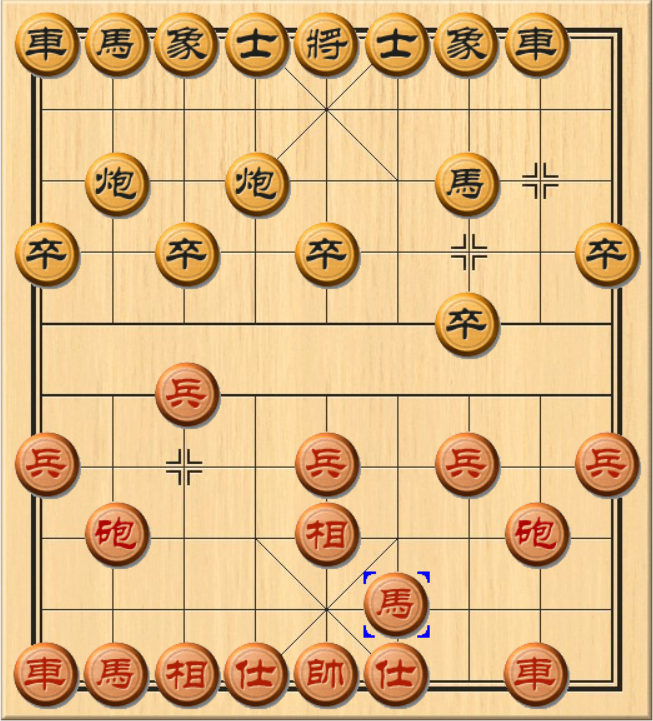

## 象棋缘起

现如今的你是否已经修改了无数次自己的象棋程序？它在你的心血浇筑之下，是否还是很像一个初学者，因此而不甚满意，甚至无数次想过放弃，又或者已经这样了。其实我很相信，不论是象棋算法的晦涩难懂，还是学习象棋本身时的步履蹒跚，往往都会让人非常头疼。但热爱总归是有一个很简单的最初的理由，支撑着自己一直去钻研。

小时候我只是看别人下棋，直到年龄稍长，并亲自下棋了以后，才发现自己的水平真的非常抽象，即使穷尽脑汁，也才在及冠之年堪堪达到天天象棋业6-1的段位。这种深深的无力感，促使我在高中时期萌发了，开发象棋引擎的种子。诚然在棋类领域，我的智力程度有限，但我可以选择摇人，而且是相对于喜怒无常的人类而言，有求必应的计算机。它将代替我继续在这一领域走下去，而这，也就是我开发象棋软件的初衷。

## 一些想法

::: tip
    不妨先来看看，飞象局最爱出现的穿宫马和对应开局过宫炮。
:::

- 过宫炮与穿宫马

很久以前我也不清楚为什么对方开局上象，我就应该走过宫炮，甚至对方先走过宫炮的时候，我还会选择主动上象去应对，认为这是正确的招法。
其实原因已经呼之欲出，就是为了防止对方的马，穿宫途经士角，进而占据象位马的极佳位置。象位马只需要走两步，就可以到达卧槽马的位置，因此不得不防。

而这种防守，是基于对方未来的招法而做出的决定。可以说，是因为我看到了未来的你和你的行为，才有了我现今的打算。因此也可以说，即使是人类下棋本身，也无法脱离对未来进行预测的方式本身，当然，这也同样适用于其它的领域。不论是传统的，你一步我一步的搜索算法， 还是直接通过机器模型得出每一个棋路未来的获胜概率，都万变不离其宗。

## 一定要效仿AlphaGo么？

为了避免走弯路，笔者很负责的告诉你，像AlphaGo那样的深度强化学习模型，需要的训练代价是极其高昂的。阿尔法狗海量的训练数据，无疑是离不开一整个谷歌团队的雄厚财力。上千块的计算核心阵列，就是它不断快速进化最强的保障和底气，而这是无数人穷极一生也绝对无法达到的目标。

但我们真的就没有出路了么？

事实上，围棋之所以选择深度神经网络，很大程度上不是因为深层神经网络自身的优越性，而是远高于象棋的复杂度，所带来的无奈。在象棋上，每步平均下来，只有45个左右的走法，这远低于围棋的250~350。这意味着，传统的搜索算法，完全可以在象棋方面做得足够好。

至于中国象棋引擎，所借鉴的国际象棋开源软件StockFish，即鳕鱼引擎,在局面评估部分所使用的NNUE高效可更新神经网络，也仅仅是一个四层的浅层前馈网络。

如此，我们便奠定了接下来的开发基调，即，一个基于传统搜索和评估算法的中国象棋引擎。至于笔者最近在尝试的机器学习（注意，不是深度学习，只是一个常见的遗传算法），在这个专题的最后一个部分，进行介绍。