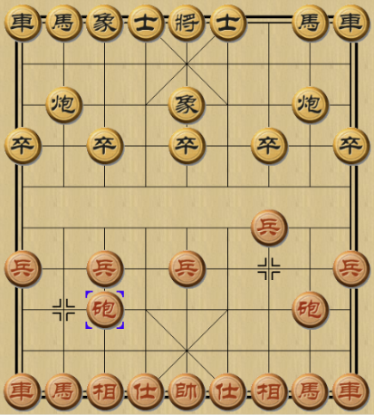

## 一级标题

### 二级标题

正文内容 ......

- 图片引用例子



- 自定义容器例子

::: tip
这是一个提示xxxxx
:::

::: info
这是一个提示
:::

::: warning
这是一个警告
:::

::: danger
这是一个危险警告
:::

::: details
这是一个 details 标签
:::

- 代码段例子

``` cpp
#include <iostream>
#include <ncurses.h>

using namespace std;

int main() {
    cout << ("Hello Wolrd!") << endl;
    getch();
    return 0;
}
```

- 任务列表例子

- [ ] 学习
- [ ] 休息
- [x] 打游戏