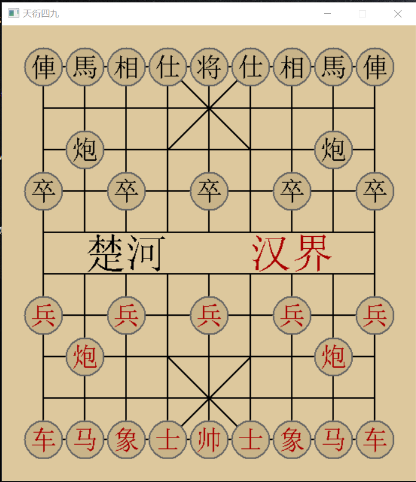

## 大致的了解

相信能看到这一节，说明至少你对象棋以及象棋引擎的开发是有浓厚兴趣的，并且如果你真的按照笔者的建议，认真学习了一门高效的语言和进阶版的数据结构设计课程，那么，你已经具备了开发一个“聪明”的AI，所需要的基本条件。

为了让读者对从零开始，对于制作象棋引擎，有一个总体上的认识，我有必要介绍它的基本结构和需要用到的算法思路。

### 从图形界面开始！



如果是一件需要长期坚持的事情，那么，细节很重要！基础也很重要！至少，你要先有一个操作性良好的界面，也许不那么美观，但它可以帮助你观察AI的行为，是否真的如你所愿的那般良好！

如果没有一个图形界面，即使你使用黑窗口，也就是CMD命令台去操作它走棋，效果也是要打折扣的，因为人的灵感，和一个美观的界面是分不开的。

毕竟，人类天生就善于在图形方面进行处理。

直白点说，它能够帮助你去除程序漏洞，闲暇之余，也可以对弈几局面，你会为它的昏招而苦恼，也会因为它的进步而感到欣喜，也不用总是孤零零的陪着一个黑色的窗口，而周围的人看到了这样一个具有艺术性美感的界面，也会为你带来更多的理解和支持。

### 局面表示

其实，在引言的第二节《知识储备》中，就已经提到过一部分的局面表示方法了，但其实，真实的方法，远比那点“皮毛”有趣。

::: tip
  16 x 16 的普通棋盘
:::

``` C++
// 棋盘初始设置
typedef unsigned char BYTE;

static const BYTE cucpcStartup[256] = {
  0,  0,  0,  0,  0,  0,  0,  0,  0,  0,  0,  0,  0,  0,  0,  0,
  0,  0,  0,  0,  0,  0,  0,  0,  0,  0,  0,  0,  0,  0,  0,  0,
  0,  0,  0,  0,  0,  0,  0,  0,  0,  0,  0,  0,  0,  0,  0,  0,
  0,  0,  0, 20, 19, 18, 17, 16, 17, 18, 19, 20,  0,  0,  0,  0,
  0,  0,  0,  0,  0,  0,  0,  0,  0,  0,  0,  0,  0,  0,  0,  0,
  0,  0,  0,  0, 21,  0,  0,  0,  0,  0, 21,  0,  0,  0,  0,  0,
  0,  0,  0, 22,  0, 22,  0, 22,  0, 22,  0, 22,  0,  0,  0,  0,
  0,  0,  0,  0,  0,  0,  0,  0,  0,  0,  0,  0,  0,  0,  0,  0,
  0,  0,  0,  0,  0,  0,  0,  0,  0,  0,  0,  0,  0,  0,  0,  0,
  0,  0,  0, 14,  0, 14,  0, 14,  0, 14,  0, 14,  0,  0,  0,  0,
  0,  0,  0,  0, 13,  0,  0,  0,  0,  0, 13,  0,  0,  0,  0,  0,
  0,  0,  0,  0,  0,  0,  0,  0,  0,  0,  0,  0,  0,  0,  0,  0,
  0,  0,  0, 12, 11, 10,  9,  8,  9, 10, 11, 12,  0,  0,  0,  0,
  0,  0,  0,  0,  0,  0,  0,  0,  0,  0,  0,  0,  0,  0,  0,  0,
  0,  0,  0,  0,  0,  0,  0,  0,  0,  0,  0,  0,  0,  0,  0,  0,
  0,  0,  0,  0,  0,  0,  0,  0,  0,  0,  0,  0,  0,  0,  0,  0
};

```

如上所示，应用了先前为棋盘“加外圈”的思想，只不过，为了让棋盘对应于计算机中最易于操作的2进制，我们将它凑成了16x16=256的棋盘。

其次，我们使用了一维数组，这能为后续的着法生成以及其它的判断，带来巨大的便利。

理由如下：

[1] 一维数组寻址更快！(相对于二维数组)

[2] 如果一维数组需要表示左右前后，只需要四个数字:

```
char DestinationIndex[4] = {-1,1,16,-16};
```

::: tip
  比较：一维数组和二维数组，对于车的走法遍历（基础版本）
:::

``` C++
  // 二维数组
  for(int x = xLeft + 1;x < xRight;x++){ //从左向右
    ······
  }
  for(int x = xRight - 1;x > xLeft;x--){ //从右向左
    ······
  }
  for(int y = yBottom + 1;y < yAbove;y++){ //从下向上
    ······
  }
  for(int y = yAbove - 1;x > yBottom;y--){ //从上向下
    ······
  }
```

::: warning
  这样不停地向四个方向遍历，书写麻烦且极易出错！
:::

``` C++
  //一维数组
  char Index[4] = {-1,1,16,-16};
  for(int t = 0;t < 4;t++){
    for(int pos = posFrom;InBoard[pos] != F;pos += Index[t]){
      ······
    }
  }
```

可以看出，一维数组，只需要很少的参数，就可以表达向四个方向的遍历计算，并且我们通过调整Index数组中的数值，可以实现更加优雅的遍历！

``` C++
  //相的目标位置
  char X_Index[4] = {-34,-30,34,30};
  //相眼的位置
  char X_Eye[4] = {-17,-15,17,15};
  //马的目标位置
  char M_Index[4][2] = {
    {-33, -31}, {-18, 14}, {-14, 18}, {31, 33}
  };
  //······其余的数组，请读者动动笔，对照256数组，算一算！
```

其实，除了这样的数组，可以大做文章，还有很多听起来不错的方案！

例如，记录32个棋子位置的数组，记录每一行/每一列棋子排列情况的数组，又或者是其它的方式？等待你去学习和发掘！

### 走法生成的备选方案

  [1] 根据棋子的规则，进行常规的生成（绕不开的笨办法）

  [2] 储存棋子在棋盘每个位置的可达位置（预置表法）

  [3] 根据每行/每列的棋子排列情况，记录车和炮一类滑膛子的可达位置（位棋盘法）

  后续会进行分别的讲解！

### 局面评估函数的构成

  ::: info
    静态评估函数举例
  ::: 

  ``` C++
    { // 马在256棋盘中，各个位置的粗略分数
      0,  0,  0,  0,  0,  0,  0,  0,  0,  0,  0,  0,  0,  0,  0,  0,
      0,  0,  0,  0,  0,  0,  0,  0,  0,  0,  0,  0,  0,  0,  0,  0,
      0,  0,  0,  0,  0,  0,  0,  0,  0,  0,  0,  0,  0,  0,  0,  0,
      0,  0,  0, 90, 90, 90, 96, 90, 96, 90, 90, 90,  0,  0,  0,  0,
      0,  0,  0, 90, 96,103, 97, 94, 97,103, 96, 90,  0,  0,  0,  0,
      0,  0,  0, 92, 98, 99,103, 99,103, 99, 98, 92,  0,  0,  0,  0,
      0,  0,  0, 93,108,100,107,100,107,100,108, 93,  0,  0,  0,  0,
      0,  0,  0, 90,100, 99,103,104,103, 99,100, 90,  0,  0,  0,  0,
      0,  0,  0, 90, 98,101,102,103,102,101, 98, 90,  0,  0,  0,  0,
      0,  0,  0, 92, 94, 98, 95, 98, 95, 98, 94, 92,  0,  0,  0,  0,
      0,  0,  0, 93, 92, 94, 95, 92, 95, 94, 92, 93,  0,  0,  0,  0,
      0,  0,  0, 85, 90, 92, 93, 78, 93, 92, 90, 85,  0,  0,  0,  0,
      0,  0,  0, 88, 85, 90, 88, 90, 88, 90, 85, 88,  0,  0,  0,  0,
      0,  0,  0,  0,  0,  0,  0,  0,  0,  0,  0,  0,  0,  0,  0,  0,
      0,  0,  0,  0,  0,  0,  0,  0,  0,  0,  0,  0,  0,  0,  0,  0,
      0,  0,  0,  0,  0,  0,  0,  0,  0,  0,  0,  0,  0,  0,  0,  0
  }
  ```

  这不是一般的位置估值数组！它融合了棋子的固有价值(例如在平稳的开中局盘面下，车通常取100%，马45%，炮50%)，从而省略了这一部分频繁的加法操作。

``` C++
  // 一般的估值矩阵
  int M_Static_Score = 45% + M_Pos_Score[M_Pos];
  // 融合了固有价值的矩阵
  int M_Static_Score = M_Pos_With_Material_Score[M_Pos]; 
```

还记得我们之前说过的吗？一句多余的代码都不要有！因为局面评估函数会在几秒钟内被调用接近两千万次！

::: info
  除此之外，其实还有很多部分
:::

[1] 棋子的灵活性（特指有效的灵活性，残局的炮没有炮架，灵活也没太大作用）

[2] 棋子的攻击性（敌方的子处于火力的交叉点）

[3] 棋子的受威胁程度（尤以将帅最为重要）

[4] 棋子的配合（运子战术:捉子、牵制、闪击、顿挫······）

[5] 战略/局势（平静与否？攻守与否？残局与否？）

[6] 棋规!（千万不要忽略这一点，没有它，程序会陷入消极的泥潭）

如果可以，你需要高效地实现它们！而绝不能频繁的扫描棋盘。

::: tip
  动态评估函数
:::

其实就是现今如火如荼的机器学习，不过，千里之行始于足下。这些新兴的方法，取得了有目共睹的成效，可你真的准备好迎接它们了么？如果还没有，不妨踏踏实实的，先做些“苦力活”。

### 搜索函数

``` 
  int Search(int 初始深度){
    int greate_vl = -∞;
    if 抵达目标搜索深度 then
      return 局面静态估值
    else
      生成所有可行的走法
        do while(还有可行的走法没有被计算){
          走这一步棋
          int vl = Search(初始深度 - 1)
          撤销这一步棋

          if 计算结果非常好 then
            return great_vl
          if 计算结果还不错，但不足以停止预测 then
            great_vl = vl
            if 当前的局面，是根节点，即，对应于游戏正在进行中的棋盘 then
              记录该走法（最后一个被记录的走法，就是最优解）
        }
    return greate_vl 
  }
```

这个搜索函数，还非常粗糙。但是重在理解，其实它非常简单，每推演到一个盘面下，就将可能的走法罗列出来逐一尝试，遇到真的还不错的就保留它的结果，并传回给上一层的搜索函数。

循环往复，从而计算出规定步数以内的最佳推演结果。

::: info
  当然，不止如此，搜索函数还有很大的改进空间！
:::

[1] 优先寻找看起来好的走法，从而提前结束搜索

[2] 记录重复找到“果子”的位置，引导引擎寻优的同时，避免重复的计算

[3] 充分利用浅层的搜索（前提是你基于浅层结果的估计，在对应情况下足够准确）

### 先验知识库

  其实就是开局库、审局库（中残局衔接阶段的杀棋库）、残局库，如此等等。它们如同人类的下棋经验，储存了很多常见局面下的优秀着法，以及应对招法。可以帮助引擎算得更远，更加健壮。

### 要点杂论

  算是一些开发流程上的经验之谈。

  [1] 引擎和界面分离，不要让两者互相干扰

  [2] 良好的封装，少用共享数据，避免你来我往的互相调用，减少混乱

  [3] 可以考虑给界面，加一些走子的动画或音效提示，提升界面的辅助开发效果

  嗯~ o(*￣▽￣*)o，暂时就这么多，路途还很遥远呢。


