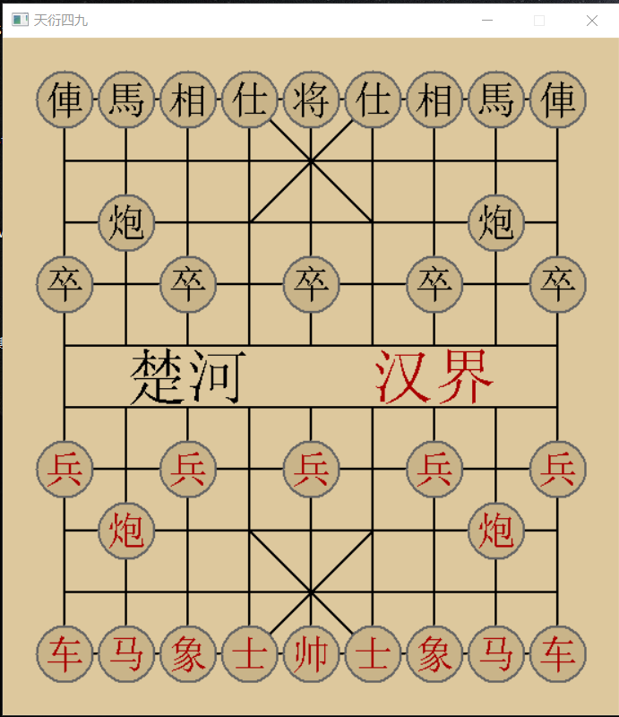

## 制作美观的棋盘

象棋棋盘，是界面的主体部分之一。除了十条横线和九条纵线以外，九宫格内还各自有两条斜线，以及河界之间是没有竖线的。

不妨再看看之前引言第三节《开始走入新的世界》中，棋盘的成品样貌。




### 选择图形库

界面主要是用来观察程序行为和去除代码漏洞，图形库应以简便易用为主。

在此推荐Easyx图形库，主要原因是比较容易上手，而且在网络上，Easyx其实是有象棋棋盘绘制的现成程序的，只不过还是得自己写一写。否则，你会不太理解原作者是如何描述棋盘中棋子位置的。

### 重要的函数

其实很简单，无非以下几个部分：

[1] 画直线

[2] 输出汉字

[3] 更改字体颜色和大小

具体的函数和用法，其实在下文已经给出了。

### 初始化图形界面

``` C++
	// BLOCK_SIZE (== 55) -> 每个正方格的像素宽度
  void Start(void) {
	  initgraph(BLOCK_SIZE * COLNum, BLOCK_SIZE * RowNum);
	  HWND HD = GetHWnd();
	  SetWindowText(HD, "天衍四九");
	  setbkcolor(RGB(221, 200, 157));
	  setlinestyle(PS_SOLID, 2);
	  cleardevice();
	  BeginBatchDraw();
}
```

::: info
  一点解释
:::

[1] initgraph(界面宽度，界面高度) -> 初始化对应尺寸的图形窗口

[2] HWND HD = GetHWnd() -> 获取图形窗口的句柄，用来更改窗口的样式

[3] SetWindowText(图形窗口句柄，被设定的名称) -> 修改图形界面名称

[4] setbkcolor(某种颜色) -> 设定窗口背景颜色为三原色:RGB(221, 200, 157)

[5] setlinestyle(PS_SOLID, 2) -> 设置线条的粗细(实线)

[6] cleardevice -> 清空屏幕

[7] BeginBatchDraw -> 批量绘图

::: info
  绘制需要在循环中不断进行，否则界面不会刷新！
:::

### 绘制棋盘格线


其实，界面坐标系的原点(0,0)，就在窗口的最左上

``` C++
  // 绘制棋盘
	setlinecolor(BLACK); // 线条颜色为黑色
	setfillcolor(RGB(221, 200, 157)); // 更改填充图形的颜色(木棕色为宜)
	for (int i = 0; i < RowNum - 2; i++) { // 每一行
		for (int j = 0; j < COLNum - 2; j++) { // 每一列
			if (i != 4) {
          fillrectangle(
            (j + 1) * BLOCK_SIZE, (i + 1) * BLOCK_SIZE,
            (j + 2) * BLOCK_SIZE, (i + 2) * BLOCK_SIZE);
			}
		}
	}

  // line(起点坐标，终点坐标)

	// 画楚河汉界外的两笔(最左和最右的竖边线)
	line(1 * BLOCK_SIZE, 5 * BLOCK_SIZE, BLOCK_SIZE, 6 * BLOCK_SIZE);
	line(9 * BLOCK_SIZE, 5 * BLOCK_SIZE, 9 * BLOCK_SIZE, 6 * BLOCK_SIZE);

	// 画两个九宫格(共计四条斜线)
	line(4 * BLOCK_SIZE, 1 * BLOCK_SIZE, 6 * BLOCK_SIZE, 3 * BLOCK_SIZE);
	line(6 * BLOCK_SIZE, 1 * BLOCK_SIZE, 4 * BLOCK_SIZE, 3 * BLOCK_SIZE);
	line(4 * BLOCK_SIZE,10 * BLOCK_SIZE, 6 * BLOCK_SIZE, 8 * BLOCK_SIZE);
	line(4 * BLOCK_SIZE, 8 * BLOCK_SIZE, 6 * BLOCK_SIZE, 0 * BLOCK_SIZE);
```

### 绘制“楚河/汉界”

``` C++
  // 调整输出样式和内容
	TCHAR s[20];
	setbkmode(TRANSPARENT);
	settextcolor(BLACK);
	settextstyle(55, 0, _T("华文行楷"));
	_stprintf_s(s, _T("楚河"));
	
  // 向界面的固定座标处，绘制"楚河"
  outtextxy(2 * BLOCK_SIZE, 5 * BLOCK_SIZE, s);

  // 更改“汉界”的字体为红色
	settextcolor(RED);
	_stprintf_s(s, _T("汉界"));

  // 同理，向界面绘制"汉界"
	outtextxy(6 * BLOCK_SIZE, 5 * BLOCK_SIZE, s);
```

### 一点叮嘱

如果想要熟练掌握它，希望读者能自行查阅资料并着手尝试，不用担心，Easyx库的用法介绍，网络上还是非常多的。我并不想把所有的代码都贴出来，如果只是粘贴复制，那没有什么意义可言，也学不到什么有价值的知识。而且，欣赏爱学习的群体，显然也是我的个人偏好。